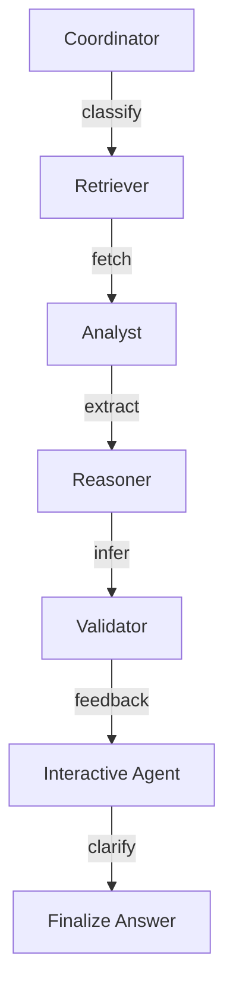

# ActiveRAG Next: Multi-Agent Reasoning System

> Retrieval-Augmented Generation meets Multi-Agent Graph-of-Thought AI — traceable, explainable, and interactive.

---

## Overview

**ActiveRAG Next** is a next-generation **Multi-Agent RAG** framework that blends:

- **Retrieval Augmented Generation (RAG)** for real-world grounding  
- **Multi-Agent Systems** (Coordinator, Retriever, Analyst, Reasoner, Validator, Interactive Agent)  
- **Graph-of-Thought Execution** (LangGraph) for dynamic, branching workflows  
- **Validation Feedback Loops** for self-correction and improved reliability  
- **Real-time Web Search Fusion** for live data augmentation  
- **Knowledge Graph Extraction** from retrieved content

Built with **Streamlit** frontend for beautiful, interactive exploration.  
Built for **research**, **production**, and **next-gen AI systems**.

---

## Architecture



- Full DAG execution via **LangGraph**.
- Conditional branching: dynamic reroutes based on validation / reasoning outcomes.
- Supports iterative loops if validation fails.
- Full traceability at every step. 📈

---

## 🚀 Features

- **Multi-Agent Intelligence**: Each step handled by specialized agents (Retriever, Reasoner, Validator, etc.)
- **Streamlit App**: Interactive UI to visualize agent thoughts, validation, final answers.
- **Graph-of-Thought DAG**: Execution graph with nodes, dynamic paths, retries.
- **Web Search Fusion**: Combine internal knowledge base + real-time web search (RAG-Fusion).
- **Knowledge Graph Extraction**: Entity and relation extraction from retrieved content.
- **Reference Control**: User-provided URLs and context docs supported.
- **Model Switching**: Choose LLM backends dynamically (Groq, OpenAI, Ollama, etc.)

---

## 🛠️ Installation

```bash
git clone https://github.com/yourname/activerag-next.git
cd activerag-next
python3 -m venv .venv
source .venv/bin/activate  # (or .venv\Scripts\activate.bat on Windows)
pip install -r requirements.txt
```

---

## Usage

### Run the Streamlit App:
```bash
streamlit run app/ui.py
```

You can now access the app at:
```
http://localhost:8501
```

---

## Example Queries

- "How does quantum teleportation work?"
- "Why is the sky blue during the day but red at sunset?"
- "According to Aristotle, which falls faster — an elephant or a ball?"

Watch the system **retrieve**, **analyze**, **reason**, **validate**, and **refine** answers — all while you **see the full thought process**. 

---

## 📈 Screenshots

> (⚡ Tip: Add some actual screenshots here later for ✨ appeal)

| Home | Reasoning | Validation |
|:---:|:---:|:---:|
|  |  |  |

---

## ⚙️ Configuration Options

You can customize in the sidebar:

- LLM Model (Groq, GPT-4, Ollama)
- Vector Database (Chroma, FAISS, Pinecone)
- Enable/Disable Live Web Search
- Select document context
- Visualize full graph execution
- Upload Reference URLs

---

### Validation-First Mindset

Unlike traditional RAGs, **ActiveRAG Next**:

- **Validates its own answers**.
- **Retries** automatically if output is weak.
- **Asks clarifying questions** if needed.
- **Provides full reasoning trace** behind every answer.

Because **truthfulness** matters.  
Because **explainability** matters.  
Because **AI shouldn't just "guess" — it should **show its work**. 📖

---

## Technologies Used

- **LangGraph** - DAG orchestration
- **LangChain** - Prompting and LLM management
- **Chroma** - Vectorstore
- **Streamlit** - UI for visualization
- **Sentence-Transformers** - Embedding models
- **Cross-Encoders** - Passage reranking
- **OpenAI / Groq / Ollama** - Language models

---

## 📅 Roadmap (Next Updates)

- [x] Multi-Agent Reasoning Graph
- [x] Real-time web augmentation
- [x] Interactive UI (Streamlit)
- [x] Knowledge graph generation
- [ ] Graph visualization (dynamic DAG during execution) 🎯
- [ ] Session saving (resume interrupted thought flows) 🧠
- [ ] Fine-grained model control (temperature, top_p, system prompts) 🔥
- [ ] LLM fallback strategies (resilience) 🛡️

---

## Contributing

Pull requests are welcome! 🙌

Please open an issue first if you want to propose major changes.  
Let’s build the future of trustworthy AI reasoning — **together**. 🛠️

---

## 📄 License

This project is licensed under the **MIT License** — free for personal, academic, or commercial use.

---

## 💬 Credits

Built with 💬, ☕, and way too much "let's make RAG systems actually intelligent" energy.  
Created by [Your Name] — let's connect on [LinkedIn](https://linkedin.com/in/yourprofile)!

---

# 🚀 Let's Raise the Standard of RAGs Forever.

---
