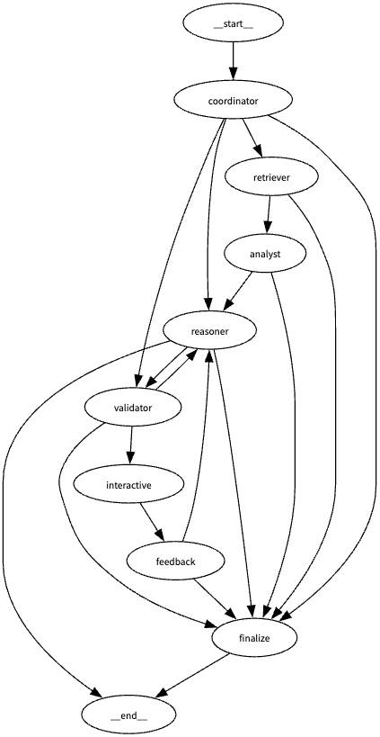

# ActiveRAG Next: Multi-Agent Reasoning System

Retrieval-Augmented Generation combined with multi-agent reasoning and validation for traceable, explainable, and interactive AI outputs.

> This project is Version 2 of [ActiveRAG](https://github.com/deepaksaipendyala/ActiveRAG)

Factual • Fast • Transparent • Interactive

---

## Overview

**ActiveRAG Next** is a modular, multi-agent Retrieval-Augmented Generation (RAG) system that integrates:

* Retrieval Augmented Generation with hybrid local and live web retrieval (RAG-Fusion)
* Modular agents for coordination, retrieval, analysis, reasoning, validation, and user interaction
* Graph-of-Thought architecture using LangGraph for dynamic, conditional execution
* Validation feedback loops for auto-correction and traceable reasoning
* Streamlit frontend for live system interaction and transparency
* Knowledge graph extraction and user-provided context integration

The system is designed for research, production-grade AI pipelines, and responsible, explainable LLM applications.

---

## Architecture



* **Coordinator** – classifies query and selects the initial path.
* **Retriever** – RAG‑Fusion version 2 supplies the top passages.
* **Analyst** – extracts entities and relations in structured JSON.
* **Reasoner** – step‑wise chain‑of‑thought over the selected passages.
* **Validator** – judges whether the answer is fully supported.
* **Interactive agent** – proposes clarifying and follow‑up questions.
* **Feedback handler** – routes based on user star rating.
* **Finalize node** – produces the answer and trace for the UI.
  
---

* LangGraph-based DAG with full conditional routing and support for iterative retries
* Modular execution with agent-specific state propagation
* Live trace visualized in Streamlit with execution logs and metrics

---

## Key Features

* **Multi-Agent Execution**: Coordinator, Retriever, Analyst, Reasoner, Validator, and Interactive Agent
* **Streaming Reasoning Flow**: Real-time response construction using `astream`
* **Validation-Aware Retry**: Low-confidence or failed outputs trigger clarification and rerun
* **Knowledge Graph Extraction**: Entities and relations rendered as a dynamic graph
* **Reference Fusion**: Combines vectorstore retrieval with real-time web search
* **User Interaction Layer**: Supports clarifications, feedback, and follow-up queries
* **Dynamic Backend Selection**: Supports Groq (LLaMA 3), OpenAI (GPT-4), and Ollama for local inference (e.g., Llama3.2b)

---

## Demo

[](https://www.youtube.com/watch?v=z9dlMpAoplo)

---

## Representative Queries

| Type        | Example                                                                            |
| ----------- | ---------------------------------------------------------------------------------- |
| Factual     | “Who first synthesised graphene?”                                                  |
| Reasoning   | “If a flight from New York to Paris is delayed by three hours, when does it land?” |
| Comparative | “Compare CRISPR and base editing in current clinical trials.”                      |
| Live data   | “Summarise the latest SEC 10‑Q filing for NVIDIA.”                                 |

Observe retrieval, analysis, reasoning, validation and feedback in real time.

---

## Project Structure

```
app/             Streamlit user interface
graph/
  ├─ state.py    Global DAG state (Pydantic)
  ├─ nodes.py    Agent implementations
  ├─ builder.py  LangGraph compilation
loaders/         PDF, Office and web page loaders
retrievers/      vectorstore.py and fusion.py
prompts/         Prompt builders for each agent
utils/           llm.py, config.py, evaluation helpers
resources/       Example documents for demo
```

---

## RAG‑Fusion Version 2: Retrieval Algorithm

1. Generate three query rewrites (original, synonym‑expanded, web‑style).
2. Perform vector search in the local store (top 15 chunks).
3. Issue a live DuckDuckGo search (top 3 web snippets).
4. Merge and deduplicate the candidates (maximum 30).
5. Score each candidate with a cross‑encoder on the pair ⟨query, passage⟩.
6. Use the Analyst’s entity list to add a small boost for passages with key entities.
7. Return the five highest‑scoring passages to the Reasoner.

---

## Installation

```bash
git clone https://github.com/yourname/activerag-next.git
cd activerag-next
python3 -m venv .venv
source .venv/bin/activate  # or .venv\Scripts\activate.bat on Windows
pip install -r requirements.txt
```
Set your provider keys in `.env` (`OPENAI_API_KEY`, `GROQ_API_KEY`) or set `LLM_PROVIDER=ollama` for local models. Customize `OLLAMA_BASE_URL` and `OLLAMA_MODEL` if needed.

---

## Running the App

```bash
streamlit run app/ui.py
```

Open your browser at:

```
http://localhost:xxxx
```

---

## Example Use Cases

* "What is Mercury?" - Provide the feedback if "you are referring to Planet or Element" - Ask the query again and check the response.
* "Who is Deepak Sai Pendyala?" - Provide my resume in resources.
* "Compare Aristotle’s and Newton’s views on gravity."

Each query is processed by a coordinated pipeline of specialized agents, producing validated, context-aware responses.

---

## Sidebar Configuration - Under Development

* Select LLM backend (OpenAI, Groq, Ollama)
* Add custom reference URLs
* Enable or disable live web augmentation
* Visualize full graph execution path
* Control document loading and context injection

---

## Technical Stack

* **LangGraph** – Graph-of-Thought DAG orchestration
* **LangChain** – LLM management and prompting
* **Streamlit** – Real-time interactive UI
* **Chroma / FAISS** – Vector database backend
* **SentenceTransformers / CrossEncoder** – RAG passage reranking
* **OpenAI / Groq / Ollama** – Language model backends

---

## Roadmap

* [x] Multi-agent DAG with LangGraph
* [x] Live web + vectorstore hybrid retrieval
* [x] Interactive feedback handling
* [x] Graph visualization of execution flow
* [x] Knowledge graph extraction
* [ ] Session persistence and history replay
* [ ] Adjustable model parameters and prompt control
* [ ] Resilient LLM fallback strategies

---

## Contribution

Contributions are welcome.
If you wish to propose significant changes, please open an issue first for discussion.

---

## License

This project is licensed under the [Apache License 2.0](LICENSE).

---

## Author

**Deepak Sai Pendyala**
LinkedIn: [linkedin.com/in/deepaksaip](https://www.linkedin.com/in/deepaksaip)
